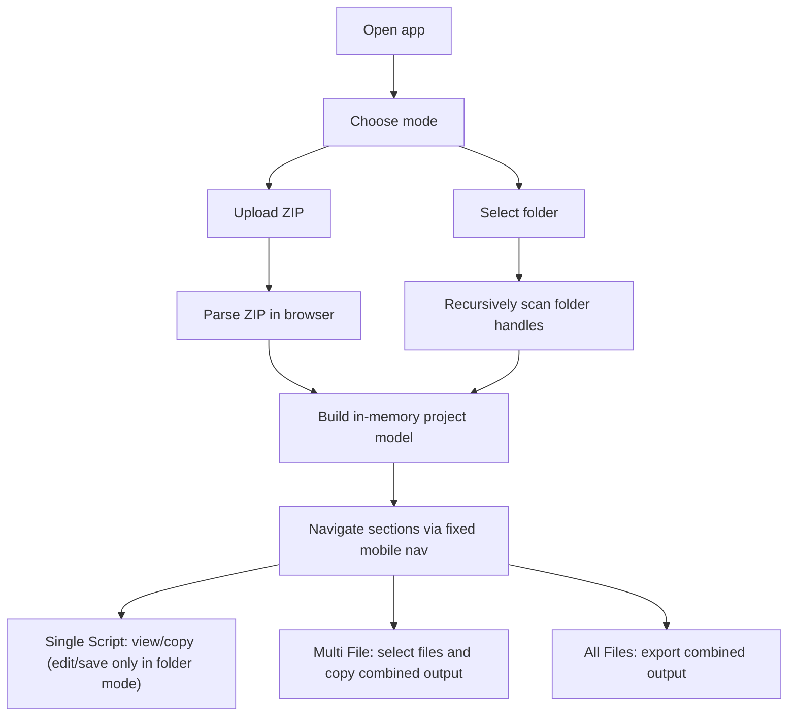

## 1. Product Overview
Script Explorer & Editor is a mobile-first, offline-capable, in-browser tool for browsing, reading, copying, combining, and (when permitted) editing scripts from either a ZIP upload or a local folder selection.
- Solves fast inspection and export of codebases on mobile/desktop without installing IDE tooling
- Target users: developers, QA, support engineers, students, and technical reviewers working on the go

## 2. Core Features

### 2.1 User Roles
Not applicable (single-user local usage only).

### 2.2 Feature Modules
1. **Home**: load project (ZIP or folder), show structure tree, copy structure
2. **Single Script**: file list + script viewer/editor, copy, optional line numbers and file name, save (folder mode only)
3. **Multi File**: multi-select list, combined output builder, copy all, optional line numbers and file name
4. **All Files**: auto-combine every readable file, export/download combined output as Markdown/Text/XML

### 2.3 Page Details
| Page Name | Module Name | Feature description |
|-----------|-------------|---------------------|
| Home | Project loader | Upload ZIP via file picker; select folder via File System Access API; show active mode and project name |
| Home | Structure view | Render complete folder tree; allow expand/collapse; optimized for deep trees |
| Home | Copy structure | Copy text representation of the folder structure to clipboard |
| Single Script | File browser | Scrollable virtualized list of files; fast search/filter; tap to open |
| Single Script | Viewer/editor | Syntax-highlighted preview; editable text area only in folder mode |
| Single Script | Controls | Copy, Show Line Numbers, Show File Name; Save visible only in folder mode |
| Multi File | Multi-select list | Checkbox list of all files; selection persists when navigating |
| Multi File | Combined output | Live combined output built from selected files in deterministic order |
| Multi File | Controls | Copy All, Show Line Numbers, Show File Name |
| All Files | Auto combine | Combine all readable files; allow fast re-generation when toggles change |
| All Files | Export | Download combined output as .md (default), .txt, .xml |

## 3. Core Process
Users load a project once, then instantly switch among Home / Single Script / Multi File / All Files without reloading data.

## 4. User Interface Design

### 4.1 Design Style
- Layout: mobile-first, single-column, stacked sections; fixed bottom navigation; back button in header on every view
- Touch targets: large buttons, large checkboxes, generous spacing, smooth scrolling
- Typography: distinctive monospace for code + readable grotesk for UI text; avoid generic system look
- Visual tone: “portable workshop” (utility-first, calm surfaces, high-contrast code area, clear status chips for ZIP vs Folder mode)
- Motion: subtle transitions on view switches, list item press feedback, skeleton loading for large scans

### 4.2 Page Design Overview
| Page Name | Module Name | UI Elements |
|-----------|-------------|-------------|
| Global | Header | Back button, current section title, mode indicator (ZIP / Folder), project name |
| Global | Bottom nav | 4 buttons (Home, Single Script, Multi File, All Files), always visible, thumb-friendly |
| Home | Loader | Two primary CTAs: “Upload ZIP” and “Select Folder” |
| Home | Structure view | Expand/collapse tree, monospace structure preview styling |
| Single Script | Split stack | File list (top) + content view/editor (bottom) with sticky controls |
| Multi File | Selection list | Large checkboxes, “selected count” indicator, combined output box |
| All Files | Output + exports | Combined output box + export buttons (.md default, .txt, .xml) |

### 4.3 Responsiveness
- Mobile-first breakpoints; single column on small screens
- On larger screens: widen content, keep navigation bottom; optionally show two-column within a section while preserving touch sizing
- Works in Android Chrome; progressive enhancement when File System Access API is available

