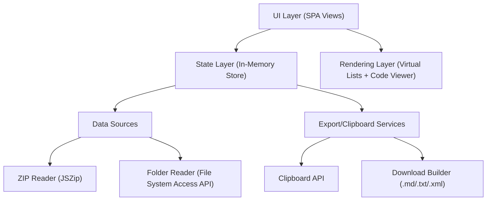

## 1. Architecture Design

## 2. Technology Description
- Frontend: HTML5 + CSS3 + Vanilla JavaScript (ES Modules)
- ZIP support: JSZip (browser build via CDN)
- Syntax highlighting: Prism.js (browser build via CDN)
- Persistence: none; all project data stored in memory for the session
- Backend: none

## 3. Route Definitions
The app is a single HTML page with internal view switching (no hard navigations).

| Route/View Key | Purpose |
|----------------|---------|
| home | Load project, show folder structure, copy structure |
| single | Browse files and view content; edit/save only in folder mode |
| multi | Select multiple files and build combined output |
| all | Combine all files and export as Markdown/Text/XML |

## 4. Data Model

### 4.1 Project State
- mode: "zip" \| "folder"
- projectName: string
- root: TreeNode
- filesByPath: Map<string, FileEntry>
- selection: Set<string>
- activePath: string \| null
- viewerOptions:
  - showLineNumbers: boolean
  - showFileName: boolean

### 4.2 TreeNode
- kind: "dir" \| "file"
- name: string
- path: string (relative posix-like path)
- children?: TreeNode[]

### 4.3 FileEntry
- path: string
- name: string
- ext: string
- size?: number
- text?: string (cached UTF-8 decoded content)
- isBinary: boolean
- handle?: FileSystemFileHandle (folder mode only; used for saving)

## 5. Key Behaviors
- Mode gating:
  - ZIP mode: viewer is read-only; Save control hidden; no file handles stored
  - Folder mode: viewer becomes editable; Save writes back to original file via handle
- Performance strategy:
  - Recursive scanning uses async iteration and yields control to avoid UI freezing
  - Virtualized rendering for long file lists (1000+ entries)
  - Lazy file loading: read file content only when opened/selected for output
  - Cached text content per path with a memory cap strategy (evict oldest if needed)
- File reading rules:
  - Detect binary heuristically (presence of NUL byte) and mark as non-readable for output
  - Respect relative paths exactly as displayed (root files show "name.ext", nested show "dir/name.ext")

## 6. Export Formats
- Markdown default:
  - Each file section: `<path>` then blank line then `---` then blank line then content then blank line then `---`
- Text:
  - Same structure without Markdown code fences
- XML:
  - `<project><file path="..."><![CDATA[...]]></file>...</project>`

## 7. Security & Permissions
- Folder mode requires explicit user gesture and permissions from `window.showDirectoryPicker()`
- Writes occur only after user clicks Save for the active file
- No network calls required for core functionality; all processing is local

